# Diagrama de Clases del Sistema - ACTUALIZADO
> Basado en el análisis del código real implementado

```mermaid
classDiagram
    %% ============================================
    %% CORE USER MANAGEMENT
    %% ============================================
    class User {
        +ObjectId _id
        +String email
        +String password
        +String firstName
        +String lastName
        +String role
        +String status
        +Object profile
        +Array permissions
        +Date createdAt
        +Date updatedAt
        +Date lastLogin
        +Object teacherData
        +Object proctorData
        +String authServiceUserId
        +Date lastSync
        +login()
        +logout()
        +updateProfile()
        +changePassword()
        +hasPermission()
        +isActive()
    }

    class Candidate {
        +ObjectId _id
        +ObjectId userId
        +Object personalInfo
        +Object academicInfo
        +Object technicalSetup
        +Array examHistory
        +String status
        +ObjectId registeredBy
        +String notes
        +Date createdAt
        +Date updatedAt
        +register()
        +verify()
        +updateTechnicalSetup()
        +getExamHistory()
        +isEligibleForLevel()
        +calculateTargetLevel()
    }

    class Role {
        +ObjectId _id
        +String name
        +String description
        +Array permissions
        +Boolean isSystem
        +Date createdAt
        +Date updatedAt
        +assignTo()
        +validate()
    }

    class Session {
        +ObjectId _id
        +String userId
        +String refreshToken
        +String userAgent
        +String ipAddress
        +Date expiresAt
        +Date createdAt
        +validate()
        +isExpired()
        +revoke()
    }

    %% ============================================
    %% ACADEMIC CONTENT MANAGEMENT
    %% ============================================
    class Level {
        +ObjectId _id
        +String code
        +String name
        +String description
        +Object competencies
        +Number order
        +Date createdAt
        +Date updatedAt
        +validateScore()
        +getRequirements()
    }

    class Rubric {
        +ObjectId _id
        +String name
        +String description
        +Array criteria
        +String type
        +Number totalMaxScore
        +Array applicableQuestionTypes
        +Date createdAt
        +Date updatedAt
        +calculateScore()
        +validateCriteria()
    }

    class Question {
        +ObjectId _id
        +ObjectId examId
        +String section
        +String type
        +String competency
        +String level
        +Number difficulty
        +String questionText
        +String questionAudio
        +Array options
        +Any correctAnswer
        +Number points
        +ObjectId rubricId
        +Object metadata
        +Date createdAt
        +evaluate()
        +validate()
        +getMediaUrl()
    }

    class Exam {
        +ObjectId _id
        +String name
        +String description
        +String level
        +Number duration
        +Array sections
        +String status
        +Number passingScore
        +Number totalPoints
        +String instructions
        +Object settings
        +ObjectId createdBy
        +Date createdAt
        +Date updatedAt
        +publish()
        +archive()
        +validateStructure()
        +calculateDuration()
        +clone()
    }

    %% ============================================
    %% SESSION MANAGEMENT
    %% ============================================
    class ExamSession {
        +ObjectId _id
        +String sessionId
        +ObjectId examId
        +String name
        +String sessionType
        +Date scheduledStartTime
        +Date actualStartTime
        +Date endTime
        +Number duration
        +String status
        +Array participants
        +Array proctors
        +Object settings
        +Object timing
        +Object stats
        +ObjectId createdBy
        +Date createdAt
        +Date updatedAt
        +schedule()
        +start()
        +end()
        +addCandidate()
        +addProctor()
        +checkCapacity()
        +cancel()
    }

    class ActiveSession {
        +ObjectId _id
        +String sessionId
        +ObjectId examId
        +String examName
        +String status
        +Map participants
        +Map proctors
        +Date scheduledStartTime
        +Date actualStartTime
        +Date endTime
        +Number duration
        +Object settings
        +Object stats
        +Date createdAt
        +Date updatedAt
        +trackParticipant()
        +updateProgress()
        +getParticipants()
    }

    class Attempt {
        +ObjectId _id
        +String sessionId
        +ObjectId examId
        +ObjectId candidateId
        +Date startTime
        +Date endTime
        +Number timeSpent
        +String status
        +Array responses
        +Number score
        +Date createdAt
        +submit()
        +abandon()
        +resume()
    }

    class Response {
        +ObjectId _id
        +ObjectId attemptId
        +ObjectId questionId
        +Any answer
        +Boolean isCorrect
        +Number pointsEarned
        +String feedback
        +Number timeSpent
        +Date submittedAt
        +autoEvaluate()
        +manualEvaluate()
    }

    class ExamResult {
        +ObjectId _id
        +String sessionId
        +ObjectId examId
        +ObjectId candidateId
        +ObjectId attemptId
        +Number overallScore
        +Number maxScore
        +Number percentage
        +Boolean passed
        +Array questionResults
        +Array competencyScores
        +String feedback
        +ObjectId evaluatedBy
        +Date evaluatedAt
        +Date createdAt
        +calculateScores()
        +determineLevel()
        +exportPDF()
    }

    %% ============================================
    %% TECHNICAL VERIFICATION
    %% ============================================
    class TechnicalVerification {
        +ObjectId _id
        +ObjectId userId
        +String sessionId
        +Object browserInfo
        +Object permissions
        +Array devices
        +Object networkTest
        +Boolean verified
        +Date verifiedAt
        +Date expiresAt
        +Date createdAt
        +initiate()
        +updateStatus()
        +finalize()
        +canProceed()
    }

    %% ============================================
    %% NOTIFICATION SYSTEM
    %% ============================================
    class Email {
        +ObjectId _id
        +String to
        +String from
        +String subject
        +String body
        +String templateId
        +Object templateData
        +String status
        +Number attempts
        +Date lastAttempt
        +Date sentAt
        +String failureReason
        +Object metadata
        +Date createdAt
        +Date updatedAt
        +send()
        +retry()
        +markSent()
        +markFailed()
    }

    class EmailTemplate {
        +ObjectId _id
        +String name
        +String code
        +String subject
        +String htmlBody
        +String textBody
        +Array variables
        +Boolean isActive
        +Date createdAt
        +Date updatedAt
        +render()
        +validate()
    }

    class NotificationInApp {
        +ObjectId _id
        +String userId
        +String type
        +String title
        +String message
        +String actionUrl
        +Boolean read
        +Date readAt
        +Date createdAt
        +Date expiresAt
        +markAsRead()
        +delete()
    }

    %% ============================================
    %% AI GRADING SERVICES
    %% ============================================
    class GradingResult {
        +ObjectId _id
        +ObjectId attemptId
        +ObjectId questionId
        +ObjectId candidateId
        +String questionType
        +Any candidateAnswer
        +Any correctAnswer
        +Number score
        +Number maxScore
        +String feedback
        +Object rubricScores
        +Object competencyScores
        +String mcerLevel
        +Date evaluatedAt
        +Number evaluationTime
        +generateFeedback()
        +calculateLevel()
    }

    class AIService {
        +String modelName
        +String version
        +Object configuration
        +evaluateText()
        +evaluateAudio()
        +evaluateEssay()
        +generateFeedback()
        +detectLevel()
        +scoreResponse()
        +generateQuestion()
    }

    %% ============================================
    %% FILE STORAGE
    %% ============================================
    class FileStorage {
        +ObjectId _id
        +String filename
        +String contentType
        +Number size
        +String path
        +String bucket
        +Object metadata
        +Date uploadedAt
        +ObjectId uploadedBy
        +upload()
        +download()
        +delete()
        +getPresignedUrl()
        +validateType()
    }

    %% ============================================
    %% SYSTEM SUPPORT
    %% ============================================
    class AuditLog {
        +ObjectId _id
        +ObjectId userId
        +String action
        +String resource
        +ObjectId resourceId
        +Object details
        +Object metadata
        +Date timestamp
        +String severity
        +log()
        +query()
        +export()
    }

    class SystemConfig {
        +ObjectId _id
        +String category
        +String key
        +Mixed value
        +String description
        +String dataType
        +Boolean isEncrypted
        +ObjectId lastModifiedBy
        +Date lastModifiedAt
        +Number version
        +get()
        +set()
        +validate()
    }

    %% ============================================
    %% RELATIONSHIPS - USER DOMAIN
    %% ============================================
    User "1" --> "0..1" Candidate : has
    User "1" --> "many" Session : has
    User "many" --> "many" Role : assigned
    User "1" --> "many" Question : creates
    User "1" --> "many" Exam : creates
    User "1" --> "many" ExamSession : creates
    User "1" --> "many" Rubric : creates
    User "1" --> "many" Level : creates

    %% ============================================
    %% RELATIONSHIPS - ACADEMIC DOMAIN
    %% ============================================
    Level "1" --> "many" Question : categorizes
    Level "1" --> "many" Exam : targets
    Level "1" --> "many" Rubric : applies_to

    Rubric "1" --> "many" Question : evaluates
    Rubric "1" --> "many" Response : scores

    Question "many" --> "1" Exam : belongs_to
    Question "1" --> "many" Response : generates

    Exam "1" --> "many" ExamSession : instantiates
    Exam "1" --> "many" Attempt : generates

    %% ============================================
    %% RELATIONSHIPS - SESSION DOMAIN
    %% ============================================
    ExamSession "1" --> "1" ActiveSession : managed_by
    ExamSession "1" --> "many" Attempt : contains
    ExamSession "1" --> "many" ExamResult : produces
    ExamSession "many" --> "many" Candidate : includes
    ExamSession "many" --> "many" User : proctored_by

    ActiveSession "1" --> "many" TechnicalVerification : requires

    Attempt "1" --> "many" Response : contains
    Attempt "1" --> "1" ExamResult : produces
    Attempt "1" --> "1" Candidate : taken_by

    Response "1" --> "1" GradingResult : evaluated_as

    %% ============================================
    %% RELATIONSHIPS - SUPPORT SERVICES
    %% ============================================
    FileStorage "many" --> "1" Question : stores_media_for
    FileStorage "many" --> "1" Response : stores_recordings_for

    Email "many" --> "1" User : sent_to
    Email "1" --> "1" EmailTemplate : uses

    NotificationInApp "many" --> "1" User : notifies

    AIService "1" --> "many" GradingResult : generates
    AIService "1" --> "many" Question : can_generate

    AuditLog "many" --> "1" User : tracks
    SystemConfig "1" --> "1" User : modified_by

    %% ============================================
    %% STYLING
    %% ============================================
    style User fill:#e3f2fd,stroke:#1565c0,stroke-width:3px,color:#000
    style Candidate fill:#e3f2fd,stroke:#1565c0,stroke-width:3px,color:#000
    style Role fill:#e3f2fd,stroke:#1565c0,stroke-width:2px,color:#000
    style Session fill:#e3f2fd,stroke:#1565c0,stroke-width:2px,color:#000

    style Level fill:#f3e5f5,stroke:#6a1b9a,stroke-width:2px,color:#000
    style Rubric fill:#f3e5f5,stroke:#6a1b9a,stroke-width:2px,color:#000
    style Question fill:#f3e5f5,stroke:#6a1b9a,stroke-width:3px,color:#000
    style Exam fill:#f3e5f5,stroke:#6a1b9a,stroke-width:3px,color:#000

    style ExamSession fill:#e8f5e9,stroke:#2e7d32,stroke-width:3px,color:#000
    style ActiveSession fill:#e8f5e9,stroke:#2e7d32,stroke-width:2px,color:#000
    style Attempt fill:#e8f5e9,stroke:#2e7d32,stroke-width:3px,color:#000
    style Response fill:#e8f5e9,stroke:#2e7d32,stroke-width:2px,color:#000
    style ExamResult fill:#e8f5e9,stroke:#2e7d32,stroke-width:3px,color:#000
    style TechnicalVerification fill:#e8f5e9,stroke:#2e7d32,stroke-width:2px,color:#000

    style AIService fill:#fff3e0,stroke:#ef6c00,stroke-width:3px,color:#000
    style GradingResult fill:#fff3e0,stroke:#ef6c00,stroke-width:2px,color:#000

    style Email fill:#fce4ec,stroke:#c2185b,stroke-width:2px,color:#000
    style EmailTemplate fill:#fce4ec,stroke:#c2185b,stroke-width:2px,color:#000
    style NotificationInApp fill:#fce4ec,stroke:#c2185b,stroke-width:2px,color:#000

    style FileStorage fill:#fff9c4,stroke:#f57f17,stroke-width:2px,color:#000
    style AuditLog fill:#efebe9,stroke:#4e342e,stroke-width:2px,color:#000
    style SystemConfig fill:#efebe9,stroke:#4e342e,stroke-width:2px,color:#000
```

## Leyenda de Colores

- 🔵 **Azul** - Dominio de Usuarios y Autenticación
- 🟣 **Morado** - Dominio Académico (Exámenes, Preguntas, Niveles, Rúbricas)
- 🟢 **Verde** - Dominio de Sesiones y Ejecución de Exámenes
- 🟠 **Naranja** - Servicios de IA y Evaluación Automática
- 🔴 **Rosa** - Sistema de Notificaciones
- 🟡 **Amarillo** - Almacenamiento de Archivos
- 🟤 **Marrón** - Auditoría y Configuración del Sistema

## Notas Importantes

### Cambios Principales respecto al Diagrama Original:

1. **Entidades Agregadas:**
   - `Role` - Sistema de roles dinámicos
   - `Session` - Sesiones de autenticación
   - `ActiveSession` - Gestión en tiempo real de sesiones de examen
   - `Attempt` - Intentos de examen separados de resultados
   - `TechnicalVerification` - Verificación técnica pre-examen
   - `EmailTemplate` - Plantillas de email
   - `GradingResult` - Resultados de evaluación por IA

2. **Entidades Removidas/No Implementadas:**
   - `SessionManager` (lógica implementada en servicios)
   - `RealtimeMonitor` (implementado como servicio, no modelo)
   - `ReportGenerator` (servicio, no modelo)
   - `Analytics` (servicio, no modelo)
   - `AuthService` (servicio, no modelo)
   - `ValidationService` (servicio, no modelo)
   - `GradingEngine` (reemplazado por AIService)

3. **Modificaciones en Entidades Existentes:**
   - `User`: Agregado `authServiceUserId`, `lastSync`, `status`
   - `Candidate`: Agregado `userId` para relación directa
   - `Question`: Agregado campos multimedia (`questionAudio`, `questionText`)
   - `ExamSession`: Agregado `sessionType`, `timing`, más configuraciones
   - `ExamResult`: Agregado `attemptId`, `competencyScores`

4. **Relaciones Modificadas:**
   - Usuario → Candidato: Ahora 1:0..1 (opcional)
   - ExamSession → ActiveSession: 1:1 para sesiones en curso
   - Attempt → ExamResult: 1:1 clara separación
   - Response → GradingResult: 1:1 para evaluación detallada

### Entidades por Servicio

**auth-service:**
- User (solo credenciales)
- Session

**user-management-service:**
- User (datos completos)
- Candidate
- Role

**exam-service:**
- Level
- Rubric
- Question
- Exam
- ExamSession
- Attempt
- Response
- ExamResult
- FileStorage

**session-manager-service:**
- ActiveSession
- TechnicalVerification

**notifications-service:**
- Email
- EmailTemplate
- NotificationInApp

**ai-grading-service:**
- GradingResult

**Servicios (no modelos):**
- AIService
- AuditLog (puede implementarse)
- SystemConfig (puede implementarse)

## Tipos de Preguntas Soportados

1. `multiple_choice` - Opción múltiple
2. `true_false` - Verdadero/Falso
3. `open_text` - Respuesta corta abierta
4. `essay` - Ensayo largo
5. `fill_blanks` - Completar espacios
6. `drag_drop` - Arrastrar y soltar
7. `matching` - Emparejar
8. `ordering` - Ordenar
9. `audio_response` - Respuesta de audio (speaking)
10. `file_upload` - Subida de archivo
11. `speaking` - Prueba oral
12. `writing` - Prueba escrita

## Niveles MCER Soportados

- A1 - Principiante
- A2 - Elemental
- B1 - Intermedio
- B2 - Intermedio Alto
- C1 - Avanzado
- C2 - Maestría

## Competencias Evaluadas

- Reading (Lectura)
- Writing (Escritura)
- Listening (Comprensión Auditiva)
- Speaking (Expresión Oral)
- Grammar (Gramática)
- Vocabulary (Vocabulario)
