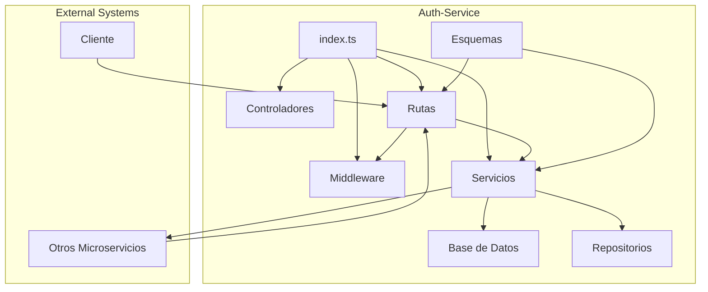

# Diagrama de Componentes del Servicio Auth-Service

Este diagrama representa los principales componentes del servicio `auth-service` y sus interacciones. Puedes visualizarlo utilizando cualquier herramienta compatible con Mermaid, como [Mermaid Live Editor](https://mermaid-js.github.io/mermaid-live-editor/).
