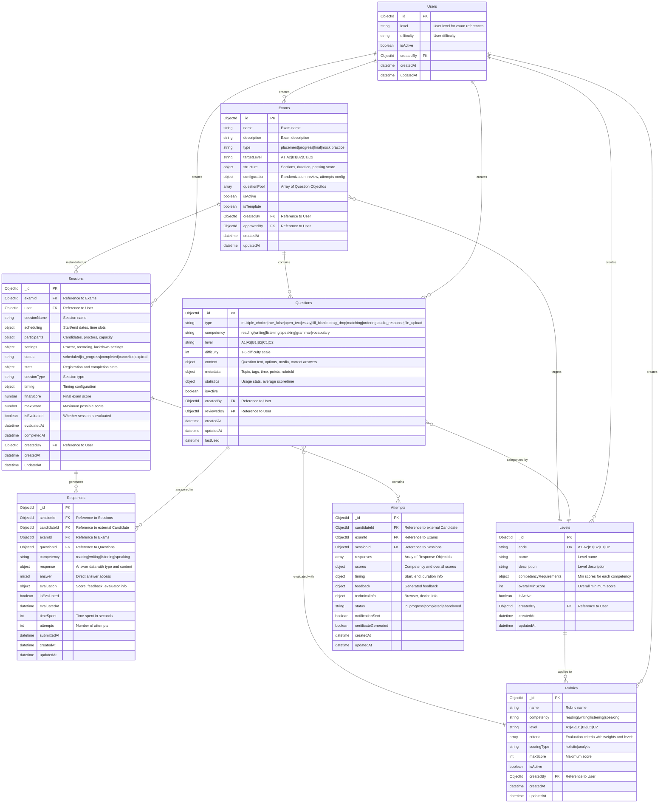

# Exam Service - Database Schema

## Field Details

### Exams Table
- **structure**: {sections: Array<{name, competency, duration, questionCount, weight}>, totalDuration, passingScore}
- **configuration**: {randomizeQuestions, allowReview, showResults, attemptsAllowed, timeBetweenAttempts}

### Questions Table
- **content**: Question text, instructions, context, mediaUrl, options, correctAnswer, keywords, templates, items, audio prompts
- **metadata**: {topic, subtopic, tags, estimatedTime, points, rubricId}
- **statistics**: {timesUsed, averageScore, averageTime, difficulty}

### Sessions Table
- **scheduling**: {startDate, endDate, timeSlots: Array<{date, startTime, endTime, capacity, enrolled}>}
- **participants**: {maxCandidates, registeredCandidates[], proctors[], currentActive}
- **settings**: {requireProctor, enableRecording, enableLockdown, allowLateEntry, lateEntryMinutes}
- **stats**: {totalRegistered, totalCompleted, totalAbandoned, averageScore}

### Responses Table
- **response**: {type, answer, selectedOptions, audioUrl, fileUrl, text}
- **evaluation**: {isCorrect, score, maxScore, feedback, evaluatedBy, evaluatorId, evaluatedAt, rubricScores}

### Levels Table
- **competencyRequirements**: {reading, writing, listening, speaking: {minScore, description, canDoStatements}}

### Rubrics Table
- **criteria**: Array<{name, description, weight, levels: Array<{score, description, examples}>}>

### Indexes
- Exams: name, type+targetLevel, isActive+isTemplate, createdBy
- Questions: type+competency+level, metadata.tags, isActive, createdBy
- Sessions: examId+status, scheduling dates, participants, status, createdBy
- Responses: sessionId+candidateId+questionId, candidateId+examId, questionId, competency
- Levels: isActive
- Rubrics: competency+level, isActive