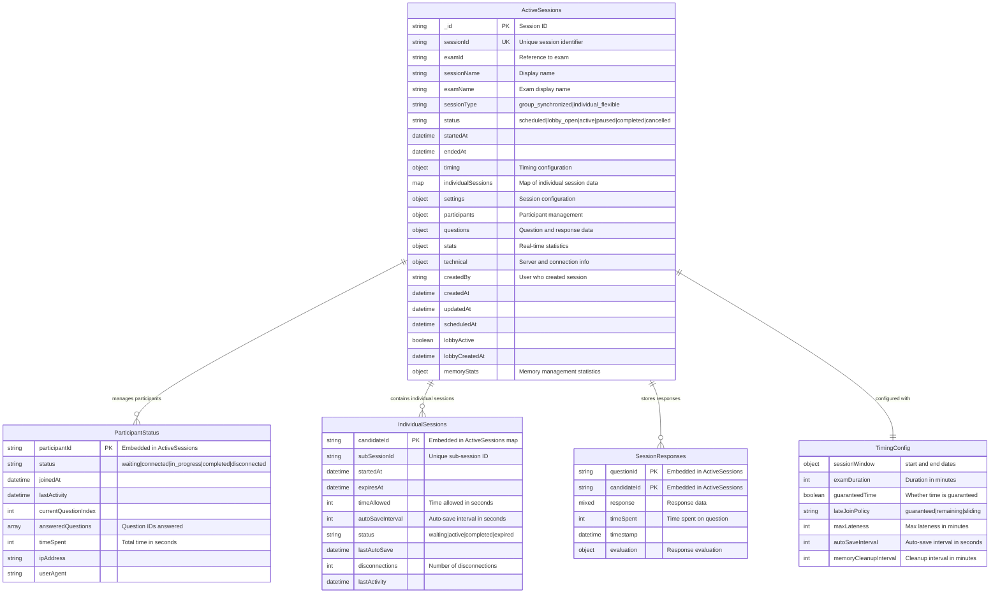

# Session Manager Service - Database Schema

## Field Details

### ActiveSessions Table
- **timing**: TimingConfig object for flexible sessions
- **individualSessions**: Map<candidateId, IndividualSessionData> for individual flexible sessions
- **settings**: {duration, autoStart, autoEnd, allowLateJoin, showResults, randomizeQuestions, maxAttempts, instructions, maxParticipants, requiresTechnicalVerification, allowOpenRegistration, registrationDeadline, competencies}
- **participants**: {registeredCandidates[], activeCandidates[], proctors[], status: Map<userId, ParticipantStatus>}
- **questions**: {totalQuestions, questionsPerCandidate: Map<candidateId, questionIds[]>, responses: SessionResponse[]}
- **stats**: {totalParticipants, activeParticipants, completedParticipants, averageProgress, averageTimeSpent}
- **technical**: {serverInstance, lastHeartbeat, connections}
- **memoryStats**: {totalSubSessions, activeSubSessions, lastCleanup, autoSaveJobs}

### ParticipantStatus (Embedded)
- Tracks real-time participant state within active sessions
- **answeredQuestions**: Array of question IDs that participant has answered
- **timeSpent**: Cumulative time spent in session

### IndividualSessions (Embedded Map)
- For individual_flexible session type only
- **subSessionId**: Format like "SESSION-ID.001", "SESSION-ID.002"
- **timeAllowed**: Individual time allocation in seconds
- **autoSaveInterval**: How often to auto-save responses
- **disconnections**: Count of network disconnections

### SessionResponses (Embedded Array)
- **evaluation**: {isCorrect, score, maxScore, feedback, evaluatedBy, evaluatedAt}
- Stores all responses within the active session for real-time processing

### TimingConfig (Embedded Object)
- **sessionWindow**: {start: Date, end: Date} - Available time window for flexible sessions
- **lateJoinPolicy**: How to handle late joiners (guaranteed time vs remaining time)
- **memoryCleanupInterval**: How often to clean expired individual sessions

### Indexes
- Primary: sessionId (unique)
- Secondary: sessionType+status, examId, participants arrays, createdAt, technical.lastHeartbeat, memoryStats.lastCleanup

### Session Types
1. **group_synchronized**: Traditional exam where all participants start/end together
2. **individual_flexible**: Participants can start within a time window and get individual time allocation

### Memory Management
- Automatic cleanup of expired individual sessions
- Memory statistics tracking for monitoring
- Auto-save functionality for individual sessions