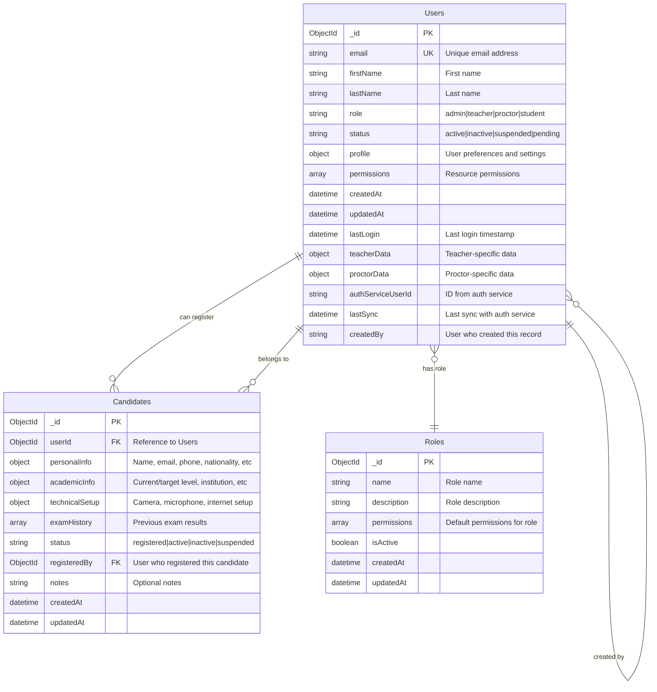

# User Management Service - Database Schema

## Field Details

### Users Table
- **profile**: Contains user preferences (language, timezone, notifications)
- **permissions**: Array of {resource: string, actions: string[]}
- **teacherData**: {department: string, specialization: string[], experience: number}
- **proctorData**: {certificationLevel: string, languages: string[], maxSimultaneousSessions: number}

### Candidates Table
- **personalInfo**: {firstName, lastName, email, phone, dateOfBirth, nationality, identification, address}
- **academicInfo**: {currentLevel: MCERLevel, targetLevel: MCERLevel, studyPurpose, institution, previousExperience}
- **technicalSetup**: {hasCamera: boolean, hasMicrophone: boolean, hasStableInternet: boolean, browser, operatingSystem}
- **examHistory**: Array of {examId, sessionId, date, level, result, overallScore, competencyScores}

### Indexes
- Users: email (unique), role, status, authServiceUserId
- Candidates: userId, status, registeredBy, personalInfo.email
- Roles: name (unique), isActive