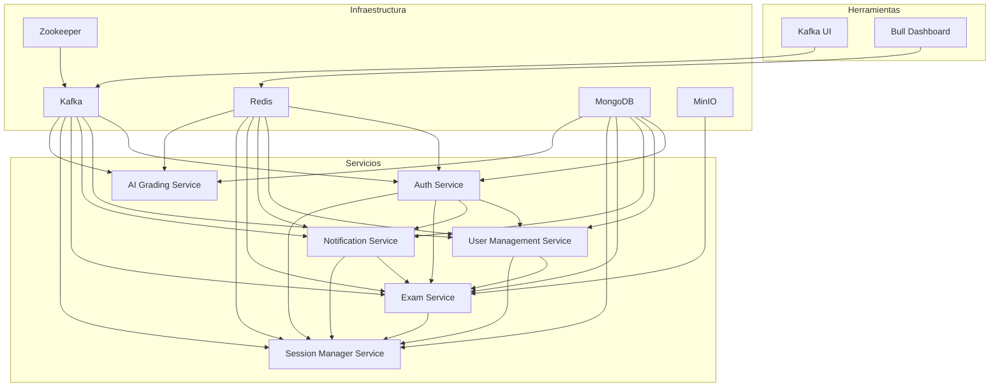

# Diagrama de Arquitectura del Sistema

Este diagrama representa la arquitectura general del sistema, mostrando las dependencias entre los servicios y las tecnologías utilizadas. Puedes visualizarlo utilizando cualquier herramienta compatible con Mermaid, como [Mermaid Live Editor](https://mermaid-js.github.io/mermaid-live-editor/).
