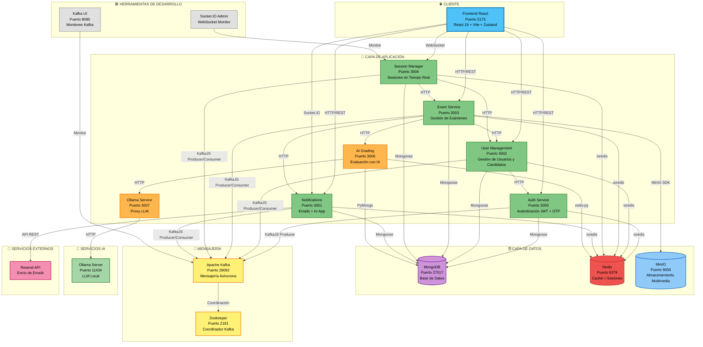
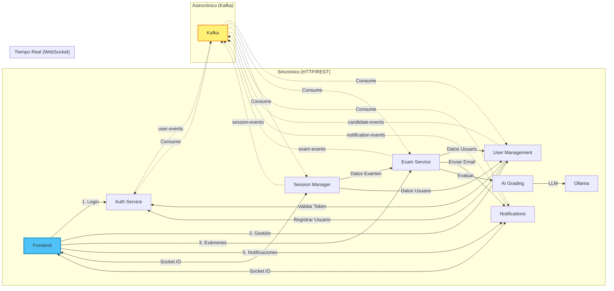
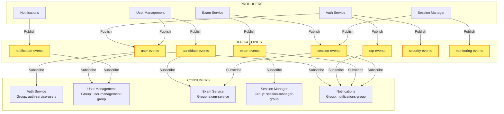
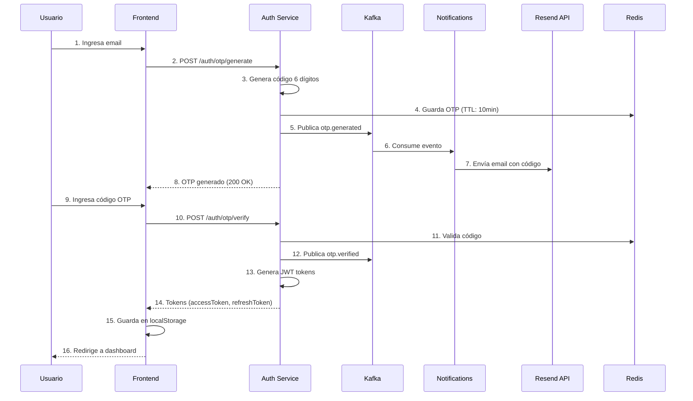
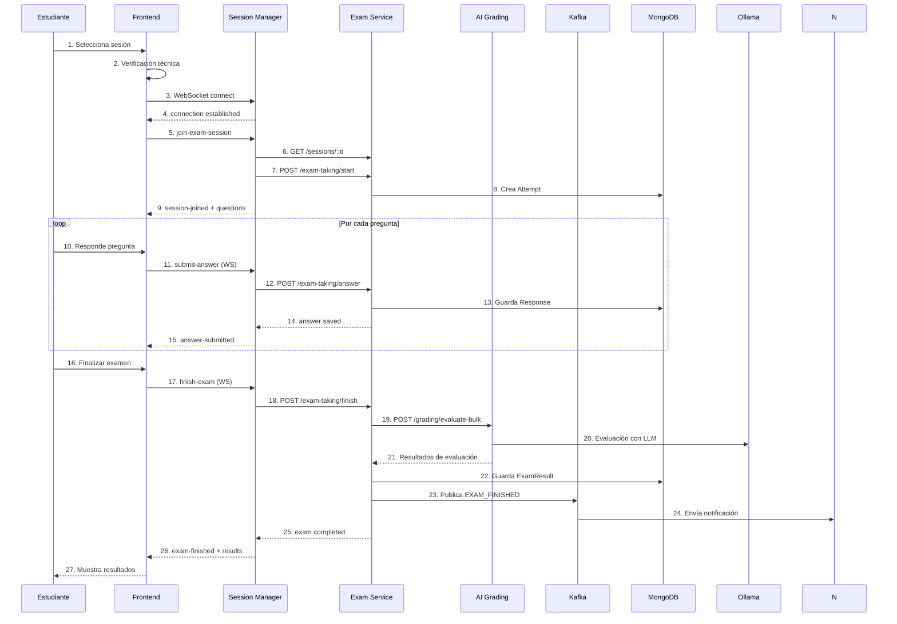
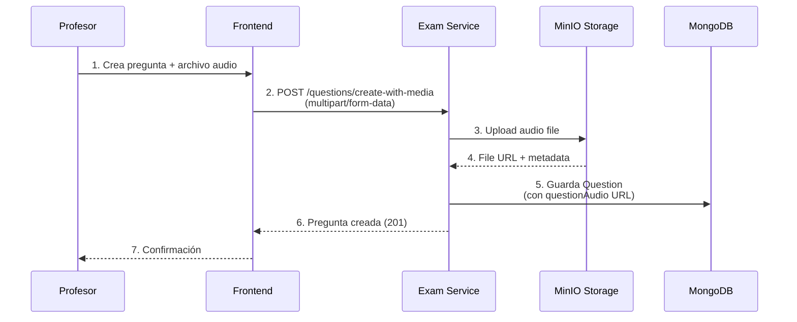

# Diagrama de Arquitectura del Sistema - ACTUALIZADO
> Arquitectura de microservicios implementada - Sistema de Evaluación UPDS

## 1. Arquitectura General del Sistema

---

## 2. Flujo de Comunicación entre Servicios

---

## 3. Arquitectura de Datos

```mermaid
graph TB
    subgraph "Bases de Datos MongoDB"
        DB1[(auth-service DB<br/>users, sessions)]
        DB2[(user-mgmt DB<br/>users, candidates, roles)]
        DB3[(exam-service DB<br/>exams, questions, sessions<br/>attempts, responses, results)]
        DB4[(session-mgr DB<br/>activesessions)]
        DB5[(notifications DB<br/>emails, templates<br/>notifications_inapp)]
        DB6[(ai-grading DB<br/>grading_results)]
    end

    subgraph "Redis Keys"
        R1[auth:session:*<br/>auth:blacklist:*]
        R2[usermgmt:cache:*<br/>usermgmt:session:*]
        R3[exam:cache:*<br/>exam:session:*]
        R4[session:active:*]
        R5[notifications:queue:*<br/>notifications:cache:*]
        R6[ai_grading:*]
    end

    subgraph "MinIO Buckets"
        M1[exam-files/<br/>- question-audio/<br/>- question-images/<br/>- response-audio/]
    end

    AuthSvc[Auth Service] --> DB1
    AuthSvc --> R1

    UserMgmt[User Management] --> DB2
    UserMgmt --> R2

    ExamSvc[Exam Service] --> DB3
    ExamSvc --> R3
    ExamSvc --> M1

    SessionMgr[Session Manager] --> DB4
    SessionMgr --> R4

    NotifSvc[Notifications] --> DB5
    NotifSvc --> R5

    AIGrading[AI Grading] --> DB6
    AIGrading --> R6

    style DB1 fill:#ce93d8,stroke:#7b1fa2
    style DB2 fill:#ce93d8,stroke:#7b1fa2
    style DB3 fill:#ce93d8,stroke:#7b1fa2
    style DB4 fill:#ce93d8,stroke:#7b1fa2
    style DB5 fill:#ce93d8,stroke:#7b1fa2
    style DB6 fill:#ce93d8,stroke:#7b1fa2
    style R1 fill:#ef5350,stroke:#c62828
    style R2 fill:#ef5350,stroke:#c62828
    style R3 fill:#ef5350,stroke:#c62828
    style R4 fill:#ef5350,stroke:#c62828
    style R5 fill:#ef5350,stroke:#c62828
    style R6 fill:#ef5350,stroke:#c62828
    style M1 fill:#90caf9,stroke:#1565c0
```

---

## 4. Arquitectura de Eventos (Kafka)

### Eventos por Topic

**user-events:**
- USER_CREATED, USER_UPDATED, USER_DELETED
- USER_STATUS_CHANGED, USER_ROLE_CHANGED, USER_PASSWORD_CHANGED
- user.registered, user.logged_in, user.logged_out, user.token_refreshed

**candidate-events:**
- CANDIDATE_REGISTERED, CANDIDATE_UPDATED, CANDIDATE_DELETED
- CANDIDATE_STATUS_CHANGED

**otp-events:**
- otp.generated, otp.verified, otp.expired, otp.revoked

**exam-events:**
- EXAM_CREATED, EXAM_PUBLISHED, EXAM_STARTED, EXAM_FINISHED
- EVALUATION_COMPLETED, RESULT_PUBLISHED

**session-events:**
- SESSION_CREATED, SESSION_STARTED, SESSION_ENDED
- PARTICIPANT_JOINED, SESSION_JOINED, SESSION_LEFT
- ANSWER_SUBMITTED

**notification-events:**
- EMAIL_SENT, EMAIL_FAILED, SMS_SENT, SMS_FAILED

**security-events:**
- auth.failed_login, auth.suspicious_activity, auth.account_locked

**monitoring-events:**
- PARTICIPANT_INACTIVE, SUSPICIOUS_ACTIVITY

---

## 5. Flujos Críticos del Sistema

### 5.1 Flujo de Registro y Login con OTP

### 5.2 Flujo de Toma de Examen

### 5.3 Flujo de Creación de Pregunta con Multimedia

---

## 6. Stack Tecnológico

### Backend Services (Node.js/TypeScript)
- **Framework:** Express.js
- **ORM:** Mongoose
- **Validación:** Zod
- **Auth:** JWT (jsonwebtoken)
- **Mensajería:** KafkaJS
- **Caché:** ioredis
- **WebSocket:** Socket.IO
- **Storage:** MinIO SDK
- **Testing:** (pendiente)

### Backend Services (Python)
- **Framework:** FastAPI
- **ORM:** PyMongo
- **IA/ML:**
  - Ollama (LLM local)
  - Whisper (transcripción audio)
  - spaCy (análisis lingüístico)
  - LanguageTool (gramática)
- **Validación:** Pydantic
- **HTTP Client:** aiohttp

### Frontend (React)
- **Framework:** React 19.1.0
- **Bundler:** Vite 7.0.0
- **Routing:** React Router 7.6.3
- **Estado:** Zustand 5.0.6
- **UI:** Radix UI + shadcn/ui
- **Forms:** React Hook Form + Zod
- **HTTP:** Axios
- **WebSocket:** Socket.io-client
- **Styling:** Tailwind CSS 4.1.11

### Infraestructura
- **Base de Datos:** MongoDB 7.x
- **Caché:** Redis 7.x
- **Mensajería:** Apache Kafka + Zookeeper
- **Storage:** MinIO
- **Containerización:** Docker + Docker Compose
- **IA:** Ollama

---

## 7. Puertos y URLs

| Servicio | Puerto | Base URL | Tecnología |
|----------|--------|----------|------------|
| Frontend | 5173 | `/` | React + Vite |
| Auth Service | 3000 | `/auth` | Express + TypeScript |
| Notifications | 3001 | `/notifications` | Express + TypeScript |
| User Management | 3002 | `/api/v1` | Express + TypeScript |
| Exam Service | 3003 | `/api/v1` | Express + TypeScript |
| Session Manager | 3004 | `/api/v1` | Express + TypeScript + Socket.IO |
| AI Grading | 3006 | `/api/v1` | FastAPI + Python |
| Ollama Proxy | 3007 | `/` | FastAPI + Python |
| MongoDB | 27017 | - | MongoDB |
| Redis | 6379 | - | Redis |
| MinIO | 9000 | - | S3-compatible |
| MinIO Console | 9001 | - | Web UI |
| Kafka | 29092 | - | Kafka |
| Zookeeper | 2181 | - | Zookeeper |
| Kafka UI | 8080 | - | Kafka UI (debug) |
| Ollama Server | 11434 | - | Ollama |

---

## 8. Seguridad

### Autenticación
- **Método:** JWT (Access Token + Refresh Token)
- **Algoritmo:** HS256
- **Access Token TTL:** 1 hora
- **Refresh Token TTL:** 7 días
- **OTP TTL:** 10 minutos
- **Storage:** localStorage (frontend), Redis (backend)

### Autorización
- **Roles:** admin, teacher, proctor, student
- **Permisos:** Resource-based (ej: exam.create, user.delete)
- **Validación:** Middleware en cada servicio
- **Inter-service:** Token especial de servicio

### Comunicación
- **HTTP:** Bearer Token en headers
- **WebSocket:** Token en handshake
- **Kafka:** Sin autenticación (red interna)
- **MongoDB:** Usuario/contraseña
- **Redis:** Contraseña

### Rate Limiting
- **Login:** 10 intentos / 15 min
- **OTP Generate:** 3 intentos / 5 min
- **OTP Verify:** 10 intentos / 5 min
- **API General:** 1000 requests / 15 min

---

## 9. Escalabilidad y Resiliencia

### Estrategias Implementadas
✅ Arquitectura de microservicios independientes
✅ Comunicación asíncrona con Kafka
✅ Caché distribuido con Redis
✅ Almacenamiento escalable con MinIO
✅ Sesiones stateless con JWT
✅ WebSocket para tiempo real

### Pendientes de Implementar
⚠️ Load balancer (Nginx/Traefik)
⚠️ API Gateway
⚠️ Circuit breakers
⚠️ Health checks robustos
⚠️ Distributed tracing
⚠️ Centralized logging
⚠️ Service mesh
⚠️ Auto-scaling
⚠️ Replicación de MongoDB
⚠️ Redis Cluster
⚠️ Kafka partitions optimization

---

## 10. Comparación: Original vs Actualizado

### Servicios Agregados ✅
- **AI Grading Service** - Evaluación con IA
- **Ollama Service** - Proxy para LLM local
- **Session Manager Service** - Gestión de sesiones en tiempo real con WebSocket

### Servicios Modificados 🔄
- **Exam Service** - Expandido con:
  - Gestión de preguntas mejorada (12 tipos)
  - Upload multimedia (MinIO)
  - Integración con IA
  - Sistema de intentos y respuestas
  - Exportación de resultados PDF

- **Auth Service** - Agregado:
  - Sistema OTP completo
  - Múltiples propósitos de OTP
  - Rate limiting avanzado
  - Consumer de eventos de user-management

- **User Management Service** - Agregado:
  - Sistema de roles dinámico
  - Importación/exportación masiva
  - Sincronización bidireccional con auth

- **Notifications Service** - Agregado:
  - Notificaciones in-app con Socket.IO
  - Plantillas de email
  - Sistema de cola y reintentos

### Tecnologías Nuevas 🆕
- **Ollama** - LLM local para evaluación con IA
- **MinIO** - Almacenamiento de archivos multimedia
- **Socket.IO** - Comunicación WebSocket bidireccional
- **Whisper** - Transcripción de audio
- **spaCy** - Análisis lingüístico
- **Puppeteer** - Generación de PDFs

### Patrones Implementados 📐
- Event-Driven Architecture (Kafka)
- CQRS (Command Query Responsibility Segregation)
- Repository Pattern
- Service Layer Pattern
- Observer Pattern (WebSocket events)

---

## 11. Monitoreo y Observabilidad

### Implementado ✅
- Kafka UI para monitoreo de mensajes
- Socket.IO Admin UI para WebSocket
- Logs básicos en cada servicio
- Health checks en endpoints `/health`

### Recomendado 📊
- **APM:** New Relic, Datadog, o Elastic APM
- **Logging:** ELK Stack (Elasticsearch, Logstash, Kibana)
- **Tracing:** Jaeger o Zipkin
- **Metrics:** Prometheus + Grafana
- **Alerting:** PagerDuty o Opsgenie

---

## 12. CI/CD y Deployment

### Actual
- Docker Compose para desarrollo local
- Scripts de deployment manual

### Recomendado
- **CI/CD:** GitHub Actions / GitLab CI
- **Container Registry:** Docker Hub / AWS ECR
- **Orchestration:** Kubernetes
- **Cloud:** AWS / GCP / Azure
- **IaC:** Terraform o Pulumi

---

Este diagrama refleja la arquitectura **real implementada** en el proyecto, basada en el análisis del código fuente.
