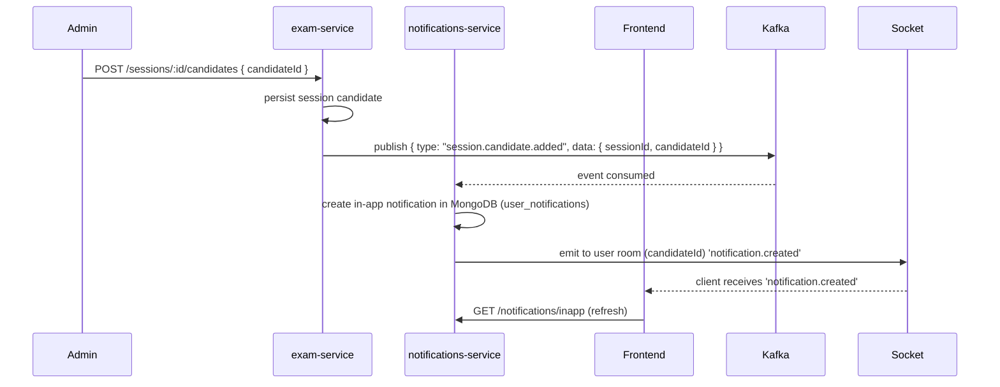

# Workflow: Evaluación de un alumno (diagramas)

Este documento contiene representaciones visuales (Mermaid) del flujo para evaluar a un alumno, adaptadas al repositorio.

## Flowchart (Mermaid)

```mermaid
flowchart TD
  A[Definir examen] --> B[Crear examen en exam-service]
  B --> C[Subir recursos a MinIO]
  C --> D[Configurar sesión]
  D --> E[Inscribir candidato]
  E --> F[Enviar notificación (notifications-service)]
  F --> G[Prechecks: identidad/permiso (auth-service)]
  G --> H[Iniciar sesión y responder preguntas]
  H --> I[Subir respuestas / archivo a MinIO]
  I --> J[Publicar evento submission.created]
  J --> K[ai-grading-service procesa -> grade.proposed]
  K --> L[Revisión humana si aplica]
  L --> M[grade.finalized]
  M --> N[Publicar resultados + notificar candidato]
  N --> O[Exportar artefactos / certificados]

  subgraph Infra
    C
    I
  end

  subgraph Messaging
    J
    K
    M
  end

```

## Sequence diagram (enrollment → in-app notification)



## Cómo usar
- Abre `docs/diagrams/exam-workflow.md` en un renderizador compatible con Mermaid (GitHub supports Mermaid in MD or use VS Code Markdown Preview Enhanced).

## Próximos pasos sugeridos
- Exportar estos diagrams a PNG/SVG y guardarlos en `docs/diagrams/`.
- Añadir diagramas más detallados (grading, appeals) según el interés.
