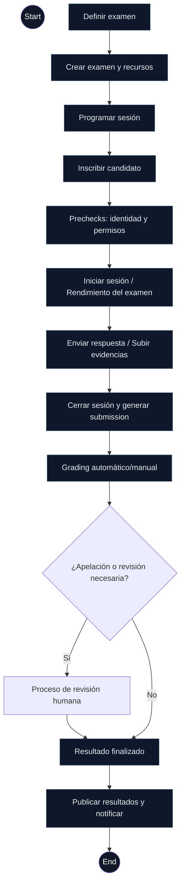

<!--
  Activity diagram (Mermaid) for the main exam workflow
  File: docs/workflows/exam-activity-diagram.md
  Purpose: high-level view of the main flow to "dar un examen"
-->

# Diagrama de actividades — Flujo principal para evaluar a un alumno

Fecha: 2025-09-06

Este diagrama representa a alto nivel el flujo principal (actividad) para evaluar a un alumno en el sistema.

Notas:
- Es un diagrama de alto nivel, pensado para documentación y onboarding.
- Se puede convertir a un diagrama UML de actividad más formal si se desea (PlantUML) y exportar a imagen.
