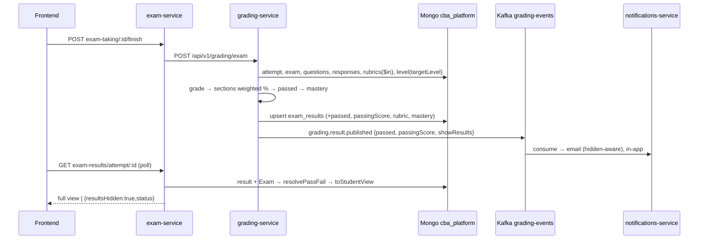

# Design: Grading Source of Truth

## Technical Approach

grading-service (`mcp-grading-server`) computes every graded fact once: weighted percentage, `passed`, `passingScore`, per-criterion rubric scores and competency mastery. It writes them to `exam_results`, and the event carries whatever notifications-service needs. exam-service, notifications-service and the frontend only read. Each backend reader has a single legacy fallback helper. The frontend holds no threshold. Pure math lives in a new `mcp-grading-server/src/grading/scoring.ts` so `grade-exam.ts` only orchestrates.

## Architecture Decisions

| # | Topic | Choice | Rejected | Rationale |
|---|-------|--------|----------|-----------|
| D1 | Result fields | Additive optional fields in both `IExamResult` copies (see Contracts) | Nested `grading{}` object | Flat optional fields: legacy docs and readers keep working |
| D2 | `responses.evaluation.rubricScores` | **Keep declared, do not populate** | Populate / drop | grade-exam never writes `responses`. Populating it creates a second source of truth. Dropping it is dead-code cleanup, which is out of scope |
| D3 | Weighted % | `Σ(p_i·w_i)/Σw_i` over sections with `maxScore>0 && w_i>0`. `p_i` = raw section points %. Round to 1 decimal | Rescaling `totalScore` | Within a section, question points still sum raw. Empty sections leave the denominator (the student is not penalized). If `Σw=0`, fall back to raw |
| D4 | When weighting applies | `sectionsStructure.length>0 && exam.type!=='placement'` → `scoringMethod:'weighted_sections'`. Otherwise `'raw_points'` | Weight placement too | Adaptive attempts have no sections. Flat-pool attempts get a single `General` section (weight 100, `examTaking.service.ts:308`), so the result equals raw anyway |
| D5 | `passed` | `status==='completed'` → `percentage >= passingScore`, using the stored rounded %. `pending_ai_review` → field omitted, meaning undetermined | Provisional boolean | A provisional `false` would be emailed as "not passed" for manual-review exams |
| D6 | Default passingScore | `DEFAULT_PASSING_SCORE = 70` when `exam.structure.passingScore` is not a number | 60 | Matches the ExamForm default (`ExamForm.tsx:129,338`) and the PDF default. `exam.schema.ts` requires it on create, so this default only covers legacy data |
| D7 | Rubric fetch | Collect distinct `metadata.rubricId` of AI-gradable questions → one `getRubrics().find({_id:{$in}})`, ignoring `isActive` | Per-question fetch | One query. The question's attached rubric is authoritative even if the rubric is later retired |
| D8 | Rubric scope | essay/open_text only (`evaluateWithGroq` path). Audio keeps its 3 fixed criteria | Audio too | `audio-delegator.ts` has its own prompt. See the user-decision section |
| D9 | Criterion → question score | AI returns 0-100 per criterion. `score = round2(Σ(c_i·w_i)/Σw_scored /100 · points)`. The AI's own total is ignored | AI total (Option B) | Deterministic and auditable (user decision #1688) |
| D10 | Partial / failed AI output | Unknown name → match by position. Non-numeric → drop. Clamp to 0-100. ≥1 valid criterion → renormalize and set `rubric.partial=true`. 0 valid, parse error or rubric not found → current 4-default-criteria prompt | Score missing criteria as 0 | A model defect must not cost the student points. Falling back keeps grading alive |
| D11 | Orphan `rubric.service.calculateScore` | Leave untouched, do not reuse | Reuse / delete | It divides the level score (1-4) by `maxScore` (100), which is a scale bug. Deleting it is out-of-scope cleanup |
| D12 | Weight validation | Zod `superRefine` in `exam.schema.ts` (create and update, when `sections.length>0`) and `rubric.schema.ts` (when `criteria` is present): `abs(Σ-100) < 0.01`, decimals allowed → 400 | Integers only | Same tolerance as the unused `Validator.validateExamStructure/validateRubricCriteria` |
| D13 | Mastery level | `exam.targetLevel` → `getLevels().findOne({code, isActive:true})`. Skip for placement or a missing level (field omitted) | Question level | One level per exam. `examLevel` is already stored |
| D14 | showResults | exam-service joins `Exam` and strips data on every student surface. The event carries `showResults` | Strip in frontend | notifications-service cannot read `exams`, and stripping in the frontend leaks data over the API |

## Pass/Fail Resolvers

| Service | Location | Signature | Legacy rule |
|---------|----------|-----------|-------------|
| grading | `src/grading/scoring.ts` | `decidePassed(pct, passingScore, status): boolean \| undefined` | n/a (writer) |
| exam | `src/utils/passFail.ts` | `resolvePassFail(result, exam?): { passed: boolean\|null; passingScore: number }` | stored → `status!=='completed'` gives null → `pct >= exam?.structure?.passingScore ?? 70` |
| notifications | `src/utils/passFail.ts` | `resolvePassedFromEvent(d): boolean\|null` | `d.passed` → null if not completed → `pct >= 70` (no exam access) |
| frontend | `examResultService.ts` private `resolvePassed(r)` | `r.passed ?? null` | null renders a neutral badge. No threshold |

exam-service exposes `passed`/`passingScore` in `my-recent` and `attempt/:id` using one batched `Exam.find({_id:{$in}})`. The PDF uses the resolver for `result.passed`, `examSettings.passingScore` and the real `examType`, and `llm-interpretation` inherits these values.

## Rubric Prompt (groq-evaluator.ts)

`evaluateWithRubric(question, answer, points, rubric)`: the prompt keeps the existing context block (in Spanish, like the current prompts), then lists the criteria:
`n. <name> (peso w%): <description>` plus descriptors `- <round(level.score/maxLevelScore*100)>: <description>`.
Response contract:
```json
{"criteria":[{"name":"<exact>","score":0,"feedback":"..."}],"feedback":"...","suggestions":["..."]}
```
`aiAnalysis.criteria` is also filled as a `name→score` map so the existing UI keeps rendering.

## Data Flow



## Interfaces / Contracts

```ts
// both IExamResult copies (lockstep)
passed?: boolean; passingScore?: number;
scoringMethod?: 'weighted_sections' | 'raw_points';
sections?: ISectionResult[];            // + weight: number; weightedPercentage: number (contribution, 0-100 scale)
competencyMastery?: ICompetencyMastery; // PR4
// IQuestionResult
rubric?: IRubricEvaluation;
interface IRubricEvaluation { rubricId: ObjectId; rubricName: string; partial?: boolean; criteria: IRubricCriterionScore[] }
interface IRubricCriterionScore { name: string; weight: number; score: number; feedback?: string }
interface ICompetencyMastery { levelCode: string; overall: IMasteryCheck; competencies: ICompetencyMasteryItem[] }
interface IMasteryCheck { minScore: number; percentage: number; achieved: boolean }
interface ICompetencyMasteryItem extends IMasteryCheck { competency: string } // skip competencies with no requirement
```
The event (`@cba/events`, zod v3 API) adds `passed: z.boolean().optional()` and `passingScore: z.number().optional()` in 1b, and `showResults: z.boolean().optional()` in PR3. It stays V1. Docker images rebuild the tarball from source (`mcp-grading-server/dockerfile:14-16`). Local dev needs `npm --prefix shared/events run pack:local` and then `npm install` in grading, notifications and exam-service.

Student view (`src/utils/resultVisibility.ts` `toStudentView(result, exam)`): when `showResults===false`, return `{_id/id, examName, examLevel, evaluatedAt/date, status, examDuration, timeAllowed, totalQuestions, resultsHidden:true}`. Everything else is dropped. It applies to `my-recent`, `:id`, `:id/detailed` and `attempt/:id`. `my-stats` excludes hidden results. `export-pdf` returns 403 `RESULTS_HIDDEN`. `/admin` and `sessions/:id/results` are unchanged. Email with `showResults===false`: subject "Examen recibido", no score or verdict, no PDF fetch. The in-app body and the grading-service HTTP fallback also leave out the score.

## File Changes (per PR, estimated changed lines)

| PR | File | Action | ~Lines |
|----|------|--------|--------|
| 1a | `mcp-grading-server/src/grading/scoring.ts` | Create (weighted %, decidePassed, default) | 90 |
| 1a | `mcp-grading-server/src/tools/grade-exam.ts`, `types/index.ts`, `schemas/grading.schemas.ts` | Modify | 80 |
| 1a | `exam-service/src/models/examResult.model.ts` | Modify | 20 |
| 1a | `exam-service/src/schemas/exam.schema.ts` + `tests/examSchema.weights.test.ts` | Modify/Create | 75 |
| 1a | `frontend/src/modules/exams/components/ExamForm.tsx` (`points`→`weight` %, running total, distribute evenly) | Modify | 70 |
| 1a | `scripts/e2e/grading-pipeline.e2e.js` | Modify | 60 |
| 1b | `shared/events/src/events/grading.ts`, grading `services/notification.service.ts`, grade-exam call sites | Modify | 25 |
| 1b | `exam-service/src/utils/passFail.ts` + test; `exam-result-pdf.service.ts`; `controllers/examResult.controller.ts` | Create/Modify | 135 |
| 1b | `notifications-service/src/utils/passFail.ts`; `services/{notification,email}.service.ts`; `grading-notification.consumer.ts` | Create/Modify | 45 |
| 1b | `frontend/src/services/examResultService.ts`, `modules/student/screens/StudentResults.tsx` | Modify | 40 |
| 2 | grading `types`, `db/collections.ts` (getRubrics), `grading/groq-evaluator.ts`, `scoring.ts`, `grade-exam.ts` | Modify | 250 |
| 2 | exam-service `examResult.model.ts`, `schemas/rubric.schema.ts` + test | Modify/Create | 85 |
| 2 | `RubricForm.tsx` (surface the 400 message only; it already enforces 100) | Modify | 5 |
| 2 | `scripts/e2e/ai-grading.e2e.js` | Modify | 70 |
| 3 | events `showResults`; grade-exam + grading notification fallback | Modify | 20 |
| 3 | `exam-service/src/utils/resultVisibility.ts` + test; controller; `examEvaluation.service.ts` | Create/Modify | 175 |
| 3 | notifications consumer, notification/email services (hidden template) | Modify | 70 |
| 3 | frontend service + StudentResults "under review" card; e2e | Modify | 80 |
| 4 | `scoring.ts` computeMastery, grade-exam, both types, resultVisibility | Modify | 100 |
| 4 | frontend StudentResults + admin review indicator; e2e | Modify | 100 |

Totals: 1a ≈395, 1b ≈245, 2 ≈410 (borderline), 3 ≈345, 4 ≈200.

## Testing Strategy

| Layer | What | Approach |
|-------|------|----------|
| Unit (jest, exam-service) | passFail, resultVisibility, exam/rubric weight refinements | `npm --prefix exam-service test` |
| E2E 1a/1b | Deterministic seed: insert exam (passingScore 80, sections 70/30), attempt with `sectionsStructure`, and responses directly in Mongo, then `gradingApi('/exam',{attemptId,force:true})`. Assert `percentage === Σp·w/Σw`, `passed:false` at 70, `scoringMethod`, event/email subject | `grading-pipeline.e2e.js` |
| E2E 2 | Insert `rubrics` doc (3 criteria 50/30/20) and set `metadata.rubricId` on the throwaway essay. Assert 3 criteria with matching names, each 0-100, and the score formula | `ai-grading.e2e.js` (GROQ key) |
| E2E 3 | `showResults:false` → student `attempt/:id` has `resultsHidden` and no `percentage`. `/admin` is complete. In-app body has no "Puntaje" | `grading-pipeline.e2e.js` |
| E2E 4 | Upsert a level for targetLevel. `competencyMastery` present, `passed` unchanged | `grading-pipeline.e2e.js` |
| Verify | grep `>= 60`, `>= 70`, `passingScore: 70` in the 5 consumers | manual |

grading-service and the frontend have no runner. The scoring functions stay pure so a runner can be added later.

## Migration / Rollout

No migration. Merge order is 1a→1b→2→3→4, and revert goes in reverse. Rebuild the grading, notifications and exam images whenever `@cba/events` changes. Existing exams whose stored section weights do not sum to 100 (legacy `points`) must be corrected on their next edit. Grading normalizes them meanwhile.

## Needs user decision

1. Default passingScore for legacy exams without one: **70** (recommended, matches the form) or 60?
2. With weighted sections, the email and UI show raw points `x/y` next to a weighted `%` that no longer equals `x/y`. Keep both (recommended) or show only the %?
3. Should rubrics also drive **audio/speaking** grading? The recommendation is to leave it out of this change and do it as a follow-up.
